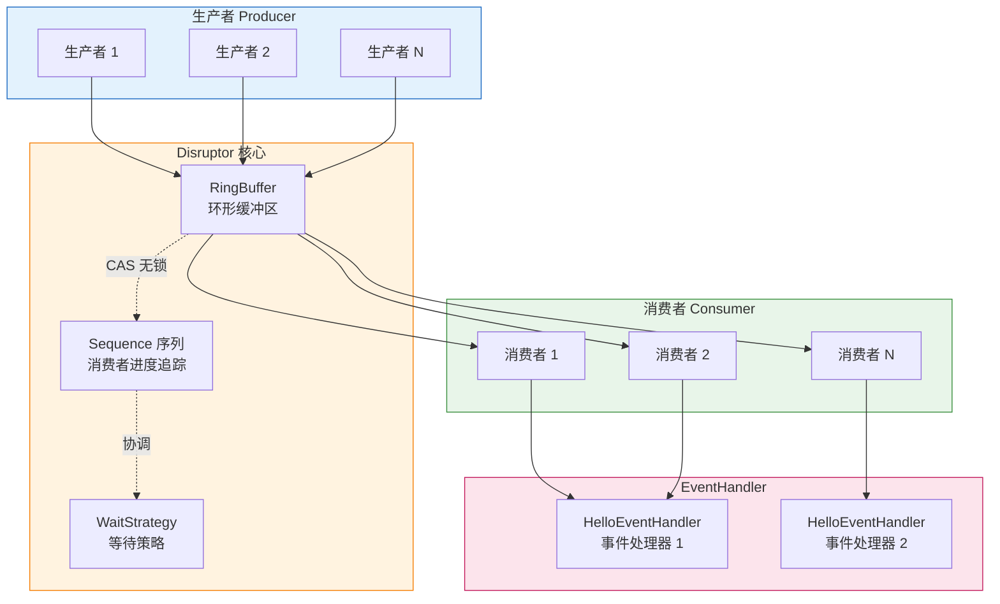
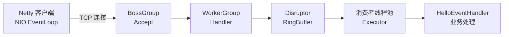

# test-Disruptor

Disruptor 高并发队列技术测试项目。

## 简介

Disruptor 是英国外汇交易公司 LMAX 开发的一个高性能队列，研发初衷是解决内存队列的延迟问题。基于 Disruptor 开发的系统单线程能支撑每秒 600 万订单。

从功能上看，Disruptor 实现了"队列"的功能，而且是一个有界队列。其应用场景是"生产者-消费者"模型的应用场合。

## 技术栈

- Java 17
- Spring Boot 3.1.5
- Disruptor 3.4.4
- Netty 4.1.86.Final（服务器层）
- Lombok

## 核心概念

Disruptor 是一种设计思路，对于存在以下元素的程序可以大幅提升性能（TPS）：
- 并发
- 缓冲区
- 生产者-消费者模型
- 事务处理

## 项目结构

```
src/main/java/wo1261931780/testDisruptor/
├── TestDisruptorApplication.java  # 启动类
├── config/
│   ├── MQManager.java             # 消息队列管理器
│   ├── BeanManager.java           # Bean 管理器
│   └── HelloEventHandler.java     # 事件处理器
├── model/
│   └── MessageModel.java          # 消息模型
├── service/
│   ├── DisruptorMqService.java    # 服务接口
│   └── Impl/
│       └── DisruptorMqServiceImpl.java  # 服务实现
└── factory/
    └── HelloEventFactory.java     # 事件工厂
```

## 系统架构图



## 快速开始

```bash
# 克隆项目
git clone https://github.com/wo1261931780/test-Disruptor.git

# 进入项目目录
cd test-Disruptor

# 运行项目
mvn spring-boot:run
```

## 核心组件

### 1. Event（事件）
消息载体，通过 `MessageModel` 定义。

### 2. EventFactory（事件工厂）
创建事件对象，通过 `HelloEventFactory` 实现。

### 3. EventHandler（事件处理器）
处理事件的核心逻辑，通过 `HelloEventHandler` 实现。

### 4. Disruptor（核心组件）
协调生产者和消费者，管理事件流转。

## 性能优势

| 特性 | 传统阻塞队列 | Disruptor |
|------|-------------|-----------|
| 吞吐量 | ~500万/s | ~600万/s |
| 延迟 | 微秒级 | 纳秒级 |
| 锁机制 | 加锁 | 无锁（CAS） |
| 内存分配 | 频繁GC | 环形缓冲区（复用） |

## 压力测试结果（Netty + Disruptor）

测试日期：2026-05-07
测试时长：3 秒
并发线程数：10
消息体：字符串消息（约 50 字节）
Disruptor 配置：RingBuffer 262144，`BlockingWaitStrategy`，2 个消费者线程

| 指标 | 结果 |
|------|------|
| 总发送请求数 | 23,414 |
| 实际测试时长 | 3,002 ms |
| QPS（发送） | **7,800 req/s** |
| 响应率 | 100%（23,414/23,414） |

> 注：消费者 `HelloEventHandler` 含 1 秒 `Thread.sleep` 模拟业务处理，实际吞吐量会受业务逻辑影响。

## Netty 服务器架构

Netty 作为网络层（Reactor 模式），接收请求后通过 Disruptor 实现高性能队列解耦：



核心组件：
- `NettyServer`：Reactor 模式，BossGroup + WorkerGroup，端口 8888
- `NettyServerHandler`：ChannelInboundHandlerAdapter，接收到消息后投放到 Disruptor
- `NettyServerStarter`：Spring Boot 启动后初始化 Netty 服务器
- `NettyPressureTestClient`：10 线程并发压测工具

## 应用场景

- 金融交易系统
- 高频交易处理
- 日志收集系统
- 消息推送服务
- 实时数据分析

## 参考资料

- [LMAX Disruptor 官方文档](https://lmax-exchange.github.io/disruptor/)
- [Disruptor GitHub](https://github.com/LMAX-Exchange/disruptor)

## License

MIT
